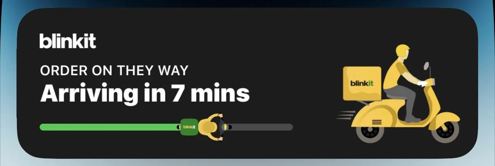
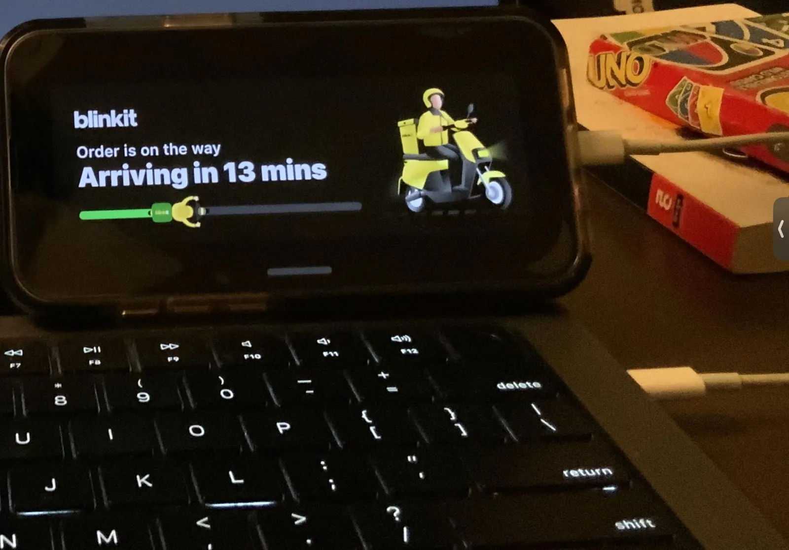

I have been writing code since I was eleven and competed at the ACM ICPC regionals before I worked on iOS at Blinkit and PhonePe. This is a record of my ten months on the Blinkit app, because most of what Krylabs does for clients today, I first did there, at the scale of a quick-commerce app in daily use across India.

## An analytics pipeline, built in-house

Blinkit sent its analytics events through Rudderstack. As the user base grew, a per-event pricing plan stopped making sense, and events were also being dropped. Those events were either worth money, because they fed the ads, or they were what you needed to rebuild a user's journey when debugging. So we brought analytics in-house and wrote the framework from scratch in Swift and Objective-C.

My part was persistence and delivery. Incoming events are written to Core Data, grouped into batches, and each batch is cleared once it reaches the server. Most of the trouble came from the persistent store coordinator that holds those batches. Later I added sending from the background with `BGTask`, so a batch does not have to wait for the app to come back to the foreground. By the time I left the pipeline was reliable, and I kept extending it as the data team's requirements grew.

## A Live Activity for every order

This one is my favourite. It is a lock screen Live Activity that counts down to the order arriving, and the same updates show in the Dynamic Island. Updates are pushed from the server, so they arrive even when the app is closed.

I was the only iOS developer on it, so a lot of the job was working out the server side with the backend team. One example: we used a standard SQS queue rather than a FIFO one, which cost noticeably less. The UI is SwiftUI, with plain Swift everywhere else. Because the Live Activity was built the standard way, it also worked in iOS 17's StandBy mode without any extra code.

Live Activities cannot make network requests, which rules out loading an image from a URL. We got around that with App Groups: the main app downloads the image and the Live Activity reads it from the shared container. That let the artwork change from the server.

## The address map

This started as a change to one header on the address selection map. The header led into search, and search led into most of the screens that deal with location. By the end I understood how location moves through the whole app, which was worth more than the header.

## The smaller things

- **Analytics tests.** End-to-end tests with Google's EarlGrey that check the expected analytics events fire during development.
- **A debug drawer.** An in-house drawer, inspired by FLEX, that shows analytics events live while you run a development build.
- **Accessibility.** App-wide changes so the app works for blind and low-vision users.
- **Release automation.** Fastlane uploads to TestFlight and the App Store. The release build got 41% faster, down to 32 minutes, and nobody had to babysit it.
- **Monitoring.** Firebase Performance setup, plus the Slack bot that posts fatal production crashes from Crashlytics and Crashlytics velocity alerts to the team.

## What carried over

All of this happens again in client work, just smaller: events that have to arrive, Live Activities and widgets, releases that ship without a person watching them, and crash alerts that reach someone quickly. Blinkit is where I learned to do those things properly.
